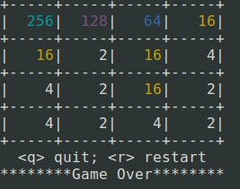

# Cpp2048
2048 game using C++ and ncurses

need c++11 compiler
```
g++ -std=c++11 main.cpp -lncurses
```



# CppFactoryPattern
factory pattern in C++

## factory1.cpp

create method for each class has the same function signature

```c++
  FooFactory::Register("FooA", FooA::Create);
  FooFactory::Register("FooB", FooB::Create);

  FooFactory::Create("FooA");
  FooFactory::Create("FooB");
```

## factory2.cpp

create method for each class can have different function signature

since the final function signature is determined by its args, there are some subtle problems. ALWAYS use call by value to define the create method here. (or maybe it can be fixed?

```c++
  FooFactory::Register("FooA", FooA::Create);
  FooFactory::Register("FooB", FooB::Create);

  FooFactory::Create("FooA", 1, 2);
  FooFactory::Create("FooB", string(":D"));
```


# CppPrime
meta-template programming to calculate the k-th prime number.


```c++
cout << Prime<5>::value << endl;
```

to do more: use sieve method

